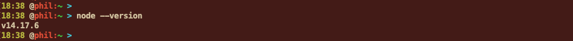
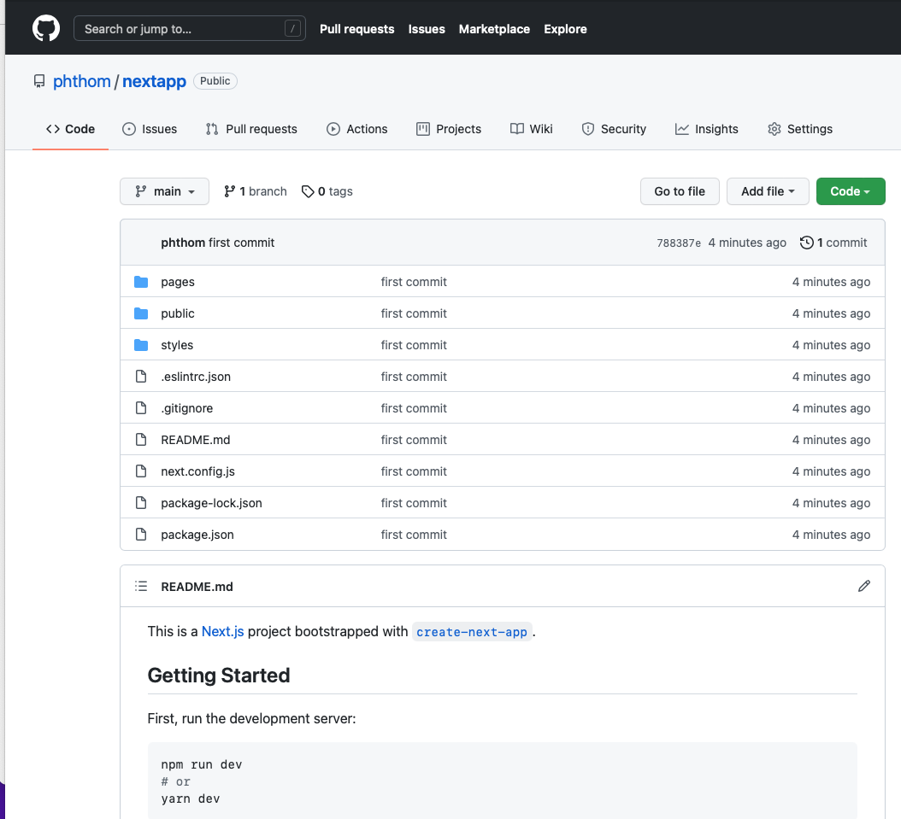
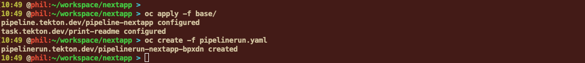
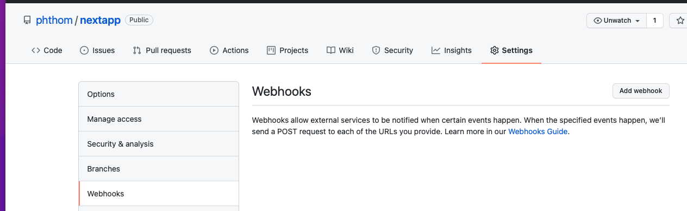

# Cloud Native CI/CD - Tekton Example


## Introduction

In this example, we are going to go thru a typical pipeline example using Tekton. Developers are commiting/pushing some code in a Git repository. This should normally trigger automatically a series of action (that I called an action chain) to clone, test, build and deploy to a Dev environment and then to a Prod environment. 


Many have asked me "**why Tekton**", and "shall I use Tekton?" - well, it depends.

Tekton is Cloud Native as its core. It aims to be for pipeline (orchestration) what k8s is for container orchestration. 

It also has a very small footprint. Its control plane can scale easily, and it provides scalable and concurrent execution of pipelines.

Its key tenants are **reusability, flexibility and interoperability.**

Tekton uses Tekton to create its own CI/CD workflows (which we call “dogfooding”) which means we have a production cluster always running Tekton, updated as soon as new releases are made. Companies like IBM and Puppet offer services based on Tekton. The IBM CD Service runs million of containers per month of customer Tekton pipelines.

See also : https://pages.github.ibm.com/cloudpakbringup/production-deployment-guides/


## Prerequisites

- Any OpenShift Cluster (with version >= 4.6) 
- You should get access to that cluster with both CLI (oc) and Console mode from your laptop
- A repository in a public GitHub account and git CLI command installed


## Connect to OpenShift Cluster


We suppose that we already have this cluster (skip if already done).

Connect to the OpenShift console and then ask the token by using the **Copy Login Command**


Display the token:


Copy the oc command (example below) :

``` 
oc login --token=sha256~2AwLLR0Rc83JLfavWNPHjeEp6y7I4dqJbxsbDiAtWQE --server=https://c100-e.us-east.containers.cloud.ibm.com:30720
```

Results:


Also connect to the OpenShift Console :


## Install OpenShift Pipelines


On the Administrator pane, go to Operators > OperatorHub  and then filter on `pipelines` and click on **Red Hat OpenShift Pipelines**


Then click on Install at the top:


Click on Install again:


It will take a few seconds to start:


If you click again on View Operator, then you will see the following page:


Click again on the Pipelines Operator to see the following:


Browse:


Follow one of the links (Download tkn ...) corresponding to your Operating System. 

Untar and then copy the tkn file into a binary file that is already in the path. Test the **tkn** command


## Node.JS and Next Installation

On your laptop, we are going to install Node.JS and a Next application (running on top of Node.JS using also React). This is very common type of workload for developers. You can read more Next.js here : https://nextjs.org/docs/basic-features/pages

So first download **Node.JS** on your laptop from here : https://nodejs.org/en/download/ and install Node.JS on your laptop.

```
node --version
```




Then on your terminal, type:

```
mkdir workspace
cd workspace
```

Then create a sample Next application:

```
npx create-next-app nextapp
```

This is going to create all the artifacts in the **nextapp** directory.


You now have a new directory nextapp that contains all the necessary file to run your application:

```
cd nextapp
ls
```


To test your application locally, enter the following command:

```
npm run dev
```


The application is running on your laptop. Open a browser with **http://localhost:3000**


## GitHub Repository Creation

First, go to you own **public GitHub account**, then go to `Settings > SSH and GPG keys`

If you don't get one, create a **new SSH key** otherwise skip the SSH key creation:


Follow this guide: 

https://docs.github.com/en/authentication/connecting-to-github-with-ssh/generating-a-new-ssh-key-and-adding-it-to-the-ssh-agent

 Check your SSH key and connect to your account:

```
ssh -T git@github.com
```


Create a new **nextapp** repository:


Type **nextapp** and click **create repository**

 


Then proceed to initialize and tag all the local files (be sure you are in the **nextapp** directory)

```
pwd
rm -rf .git
git init
git add -A
git commit -m "first commit"
git branch -M main
```


Replace <github account> with your GitHub account name:

```
git remote add origin git@github.com:<github account>/nextapp.git 
```

Then push the local repository to your remote repository:

```
git push -u origin main
```


Look at your repository on the GitHub web site:




Your repository is now ready for the next step.


## Task#1 Clone


 

Now that we have created a remote repository, the first task in the pipeline will be the cloning of that repo inside the OpenShift cluster. And more specifically into a workspace on a persistent volume. 

For a CI pipeline to work, it first needs to acquire its main input: the codebase that you want to build and deploy. In this first version of the pipeline, you will have two Tasks:

1. clone the source repository - and for that task, we use the `git-clone` tekton task. 
2. run `cat README.md` as confirmation that `git-clone` (and the workspace) are functioning as intended


`git-clone` has been configured as a `ClusterTask` on your cluster:

```
oc get clustertasks | grep -i git-clone
```


Have a look at the [`git-clone` documentation](https://github.com/tektoncd/catalog/tree/main/task/git-clone/0.3) and you will notice that the least amount of data you may provide to the `git-clone` task is a workspace and URL of the Git repository to clone. For simplicity, you will use [this public repository](https://github.com/upslopeio/express-sample-app) so that you can avoid the complexities of authentication.

Now create a new **project** called **<your-name>-nextapp**:

```
oc new-project <your-name>-nextapp
```


We are going to store all the artifacts concerning ci/cd into a directory called  **base**

```
pwd
mkdir base
ls
touch base/pipeline.yaml
```


We are going to store the pipeline definitions (and the tasks and the steps) in a file called **pipeline.yaml**

Here is the pipeline first definition:

```
apiVersion: tekton.dev/v1beta1
kind: Pipeline
metadata:
  name: pipeline-nextapp
spec:
  params:
    - name: source-repo
      type: string
      description: Source code repository
  tasks:
    - name: clone-repository
      params:
        - name: url
          value: "$(params.source-repo)"
      taskRef:
        name: git-clone
        kind: ClusterTask
      workspaces:
        - name: output
          workspace: pipeline-shared-data
  workspaces:
    - name: pipeline-shared-data

```


A repository can be shared between build steps if you use a [`PersistentVolume`](https://kubernetes.io/docs/concepts/storage/persistent-volumes/). This introduces [Kubernetes storage](https://kubernetes.io/docs/concepts/storage/). For your use case in this course, the easiest approach is to create a [`PersistentVolumeClaim` (PVC)](https://kubernetes.io/docs/concepts/storage/persistent-volumes/#persistentvolumeclaims) which will manage the `PersistentVolume` binding process for you.

One important detail about Tekton is that a `Pipeline` will expect its `PipelineRun` to provide the workspaces and Volume bindings. Similar to `TaskRun`, you will use a generated name and `oc create -f <file-name>.yaml` with a separate `PipelineRun` file.

Now create a new file to run the pipeline like a job if you will. create this file in the **nextapp directory** (not in the base sub-directory -- we will why later). 

```
touch pipelinerun.yaml
```

Copy this content in the file (**change to your github account**)

```
apiVersion: tekton.dev/v1beta1
kind: PipelineRun
metadata:
  generateName: pipelinerun-nextapp-
spec:
  params:
    - name: source-repo
      value: https://github.com/<your-account>/nextapp
  pipelineRef:
    name: pipeline-nextapp
  workspaces:
    - name: pipeline-shared-data
      volumeClaimTemplate:
        spec:
          resources:
            requests:
              storage: 1Gi
          accessModes:
            - ReadWriteOnce

```

In this case you use a [`volumeClaimTemplate`](https://kubernetes.io/docs/concepts/storage/persistent-volumes/) to ask the cluster for enough resources for your PipelineRun.

Now let's create the **pipeline** and the **pipelinerun** 

```
oc create -f base/pipeline.yaml
oc create -f pipelinerun.yaml
```


Check the logs:

```
tkn pr logs pipelinerun-nextapp-mcd57
```


Finally, your goal is to run `cat README.md` to confirm that you are sharing data between Tasks (Pods) in your Pipeline.

Now you will define a new task named `print-readme`, then add a `print-readme` step to your pipeline inside of `nodejs.Pipeline.yaml`:


```
touch base/print-readme.yaml
```

Add the following content:

```
apiVersion: tekton.dev/v1beta1
kind: Task
metadata:
  name: print-readme
spec:
  steps:
    - name: print
      image: quay.io/ibmgaragecloud/alpine-curl
      script: |
        cat dir-with-readme/README.md
  workspaces:
    - name: dir-with-readme

```

And then we have to modify the pipeline to add that task:

```
apiVersion: tekton.dev/v1beta1
kind: Pipeline
metadata:
  name: pipeline-nextapp
spec:
  params:
    - name: source-repo
      type: string
      description: Source code repository
  workspaces:
    - name: pipeline-shared-data
  tasks:
    - name: clone-repository
      params:
        - name: url
          value: "$(params.source-repo)"
      taskRef:
        name: git-clone
        kind: ClusterTask
      workspaces:
        - name: output
          workspace: pipeline-shared-data
    - name: print-readme
      runAfter:
        - clone-repository
      taskRef:
        name: print-readme
        kind: Task
      workspaces:
        - name: dir-with-readme
          workspace: pipeline-shared-data
```

This final YAML shows three important concepts:

1. using an existing `Task` from the Tekton Catalog
2. writing a custom `Task`
3. starting with a clean build folder and sharing files across tasks by using a `volumeClaimTemplate`. (A `PersistentVolumeClaim` would have used the same persistent volume for every pipeline run rather than a new volume for each pipeline run.)

Now do the following:

```
oc apply -f base/
oc create -f pipelinerun.yaml
```


After a few second, the pipeline is still running:


After some time, the 2 tasks will appear:


You can also look at the OpenShift Console:


Or this way:


It took around **2 minutes** to copy the repo into the openshift cluster storage. 


## TASK#2 CI Tests


One of the most important steps in a Continuous Integration (CI) pipeline is running the tests. Since your application uses Node, you will use the `npm install-ci-test` command to validate that the current code does not introduce test failures.

This requires another task/step after cloning the repository:

1. `npm install-ci-test` - run a clean installation of the project dependencies, then run all the tests.

You can look at the Tekton hub to check the npm definitions:

``` 
https://hub.tekton.dev
```


Search `npm`in the tekton catalog:


You must also first check if the `npm` is part of the cluster tasks or the tasks in OpenShift:

```
oc get clustertasks | grep npm
oc get task | grep npm
```


If you get no answers from both queries then decide to add a new task.

You can install the task using `kubectl` or `oc`. Be sure to be in your project.

```
oc project <your-name>-nextapp
oc apply -f https://raw.githubusercontent.com/tektoncd/catalog/main/task/npm/0.1/npm.yaml
```


Then list the taks to search the npm: 

```
oc get task | grep npm
```


Or you can also use the tkn CLI:

``` 
tkn tasks list
tkn task describe npm
```


Next add a `run-tests` task/step to your pipeline: 


Here is the changed `pipeline.yaml` file that you can copy/paste to your file:

```
apiVersion: tekton.dev/v1beta1
kind: Pipeline
metadata:
  name: pipeline-nextapp
spec:
  params:
    - name: source-repo
      type: string
      description: Source code repository
  tasks:
    - name: clone-repository
      params:
        - name: url
          value: "$(params.source-repo)"
      taskRef:
        name: git-clone
        kind: ClusterTask
      workspaces:
        - name: output
          workspace: pipeline-shared-data
    - name: print-readme
      runAfter:
        - clone-repository
      taskRef:
        name: print-readme
        kind: Task
      workspaces:
        - name: dir-with-readme
          workspace: pipeline-shared-data
    - name: run-tests
      params:
        - name: ARGS
          value:
            - install-ci-test
      runAfter:
        - print-readme
      taskRef:
        name: npm
      workspaces:
        - name: source
          workspace: pipeline-shared-data
  workspaces:
    - name: pipeline-shared-data
```


Now do the following:

```
oc apply -f base/
oc create -f pipelinerun.yaml
```


You can check the logs with the  `oc pr logs -f` to observe the progress of the pipeline in the terminal. You can also see the `PipelineRun` and its progress in the OpenShift console. Open the OpenShift console by running `oc console` in the terminal.

Both steps in the pipeline should run sequentially and complete successfully.




## TASK#3 Build & Push


Now that we have copied and tests the source code, we can use it to build your application and the container.

[`buildah`](https://github.com/containers/buildah) is tool for building Open Container Initiative (OCI) containers. buildah, for your case, will use a [Dockerfile to build a container](https://github.com/containers/buildah/blob/master/docs/tutorials/01-intro.md#using-dockerfiles-with-buildah).

`buildah` has been configured as a `ClusterTask` on your cluster:

```
oc get clustertasks | grep -i buildah
```


You see several versions. 

It is important to note that for this training, you need to use the `0.1` release of the buildah Tekton Task since the `0.2` version is incompatible with OpenShift Container Platform `4.6` or greater. 

Look at the documentation here: https://github.com/tektoncd/catalog/tree/main/task/buildah/0.1


We need a new parameter to define the final **image repository** in a container registry.

We use the **internal OpenShift registry**, we will specify the new parameter for the pipelinerun and also in the pipeline definition like this:

```
    - name: image-repo
      value: image-registry.openshift-image-registry.svc:5000/<project>/nextapp
```

We need also that the Service Account  defines  the "edit" relationship between the **pipelinerun** with the **secret**:

``` 
oc adm policy add-role-to-user registry-editor -z pipeline
oc adm policy add-role-to-user edit -z pipeline
```


We also need a new file in the the repository called **Dockerfile** that contain the instruction to build the final image in the image registry. 

So  here is an example to be used as a **Dockerfile**

```
pwd
touch Dockerfile
ls
```


Modify the Dockefile content with these lines (I tried to build a thin image by avoiding to much layers)

```
FROM node:alpine AS deps
RUN apk add --no-cache libc6-compat
WORKDIR /app
COPY package.json ./
RUN yarn install --frozen-lockfile

# Rebuild the source code only when needed
FROM node:alpine AS builder
WORKDIR /app
COPY . .
COPY --from=deps /app/node_modules ./node_modules
RUN yarn build && yarn install --production --ignore-scripts --prefer-offline

# Production image, copy all the files and run next
FROM node:alpine AS runner
WORKDIR /app

ENV NODE_ENV production

RUN addgroup -g 1001 -S nodejs
RUN adduser -S nextjs -u 1001

COPY --from=builder /app/next.config.js ./
COPY --from=builder /app/public ./public
COPY --from=builder --chown=nextjs:nodejs /app/.next ./.next
COPY --from=builder /app/node_modules ./node_modules
COPY --from=builder /app/package.json ./package.json

USER nextjs
EXPOSE 3000
CMD ["yarn", "start"]
```

I also added a numeric user (different from root ).


Now here is the **pipeline.yaml** with all the different tasks:

```
apiVersion: tekton.dev/v1beta1
kind: Pipeline
metadata:
  name: pipeline-nextapp
spec:
  params:
    - name: source-repo
      type: string
      description: Source code repository
    - name: image-repo
      type: string
      description: Docker image repository
  workspaces:
    - name: pipeline-shared-data
  tasks:
    - name: clone-repository
      params:
        - name: url
          value: "$(params.source-repo)"
      taskRef:
        name: git-clone
        kind: ClusterTask
      workspaces:
        - name: output
          workspace: pipeline-shared-data
    - name: print-readme
      runAfter:
        - clone-repository
      taskRef:
        name: print-readme
        kind: Task
      workspaces:
        - name: dir-with-readme
          workspace: pipeline-shared-data
    - name: run-tests
      params:
        - name: ARGS
          value:
            - install-ci-test
      runAfter:
        - print-readme
      taskRef:
        name: npm
      workspaces:
        - name: source
          workspace: pipeline-shared-data
    - name: create-image
      params:
        - name: IMAGE
          value: "$(params.image-repo):$(tasks.clone-repository.results.commit)"
        - name: TLSVERIFY
          value: "false"
      runAfter:
        - run-tests
      taskRef:
        name: buildah
        kind: ClusterTask
      workspaces:
        - name: source
          workspace: pipeline-shared-data
```


And here is the **pipelinerun.yaml** (we added the image-repo): Replace <account> and <project> with the corresponding names.

```
apiVersion: tekton.dev/v1beta1
kind: PipelineRun
metadata:
  generateName: pipelinerun-nextapp-
spec:
  params:
    - name: source-repo
      value: https://github.com/<account>/nextapp
    - name: image-repo
      value: image-registry.openshift-image-registry.svc:5000/<project>/nextapp
  pipelineRef:
    name: pipeline-nextapp
  workspaces:
    - name: pipeline-shared-data
      volumeClaimTemplate:
        spec:
          resources:
            requests:
              storage: 1Gi
          accessModes:
            - ReadWriteOnce
```


Now do the following:

```
git add -A
git commit -m "first commit"
git push -u origin main
oc apply -f base/
oc create -f pipelinerun.yaml
```


And the result is:


## TASK#4 Manifests


After pushing the image into a registry, it is also necessary to prepare some Kubernetes resources (yaml files). 

Next, we will use [Kustomize](https://kustomize.io/) to build your Kubernetes configuration. Kustomize is a tool for customizing Kubernetes YAML configuration files.

For this, we are going to create a new directory and then populate this directory with some files. 

```
cd ~/workspace/nextapp
mkdir k8s
cd k8s
touch deployment.yaml service.yaml route.yaml kustomization.yaml
```

Here is the content for **deployment.yaml**

```
apiVersion: apps/v1
kind: Deployment
metadata:
  name: sample-app
spec:
  replicas: 1
  selector:
    matchLabels:
      app.kubernetes.io/instance: app-instance
      app.kubernetes.io/name: app
  template:
    metadata:
      labels:
        app.kubernetes.io/instance: app-instance
        app.kubernetes.io/name: app
    spec:
      restartPolicy: Always
      terminationGracePeriodSeconds: 30
      dnsPolicy: ClusterFirst
      schedulerName: default-scheduler
      containers:
      - name: sample-app
        image: quay.io/astalavista/sample-app:d90c742ee626048c4d1e2032eb836255e4036561
        ports:
        - name: http
          protocol: TCP
          containerPort: 3000
        env:
        - name: INGRESS_HOST
        - name: PROTOCOLS
        - name: LOG_LEVEL
          value: debug
        resources: {}
        livenessProbe:
          failureThreshold: 3
          httpGet:
            port: 3000
            path: /
            scheme: HTTP
          periodSeconds: 10
          successThreshold: 1
          timeoutSeconds: 1
        readinessProbe:
          failureThreshold: 3
          httpGet:
            port: http
            path: /
            scheme: HTTP
          periodSeconds: 10
          successThreshold: 1
          timeoutSeconds: 1
        terminationMessagePath: /dev/termination-log
        terminationMessagePolicy: File
        imagePullPolicy: IfNotPresent
      securityContext: {}
  revisionHistoryLimit: 10
  progressDeadlineSeconds: 600
```

The content for **service.yaml**

```
apiVersion: v1
kind: Service
metadata:
  name: sample-app
spec:
  type: ClusterIP
  selector:
    app.kubernetes.io/instance: app-instance
    app.kubernetes.io/name: app
  ports:
  - name: http
    protocol: TCP
    port: 80
    targetPort: 3000
  sessionAffinity: None
```

The content for **route.yaml**

```
apiVersion: route.openshift.io/v1
kind: Route
metadata:
  name: sample-app
spec:
  tls:
    termination: edge
  to:
    name: sample-app
    kind: Service
    weight: 100
  wildcardPolicy: None
```

And finally for **kustomization.yaml**

``` 
apiVersion: kustomize.config.k8s.io/v1beta1
kind: Kustomization
resources:
  - deployment.yaml
  - service.yaml
  - route.yaml
commonLabels:
  app: nextapp
  app.kubernetes.io/instance: nextapp
  app.kubernetes.io/name: nextapp
```


Open `deployment.yaml` and notice the labels in the `spec.template.metadata.labels` field.

Then, open `service.yaml` and notice that matching labels are specified in the `spec.selector` field. A Service is an abstract way to expose an application running on a set of Pods as a network service. The set of Pods targeted by a Service is usually determined by specifying matching labels in the selector. The Service targets any Pod with labels that match the selector.

While you won't have time to learn all about [Kubernetes Labels and Selectors](https://kubernetes.io/docs/concepts/overview/working-with-objects/labels/) you will need them for the Service to target the correct pods and for the OpenShift Developer Perspective Topology View to display links to a specific commit in your GitHub repository.

> You might want to review the [Common labels](https://kubernetes.io/docs/concepts/overview/working-with-objects/common-labels/) used in Kubernetes.


Explain Kustomize edit/build: When you type some kustomize commands (like the ones below), you will setup some configuration parameters in the customisation.yaml file. 


Since there is **no Tekton Catalog task for Kustomize**, you will construct your own Task, doing the development for this locally will help you get a better understanding of Kustomize.

Next, define a custom Tekton Task in `base/manifest.yaml`:

```
apiVersion: tekton.dev/v1beta1
kind: Task
metadata:
  name: manifest
spec:
  params:
    - name: app-name
      description: the name of the app
    - name: commit
      description: The precise commit SHA used for this task
    - name: image-repo
      description: contains the full image repository (without :tag)
    - name: source-repo
      description: Source git repository
  results:
    - name: manifest
      description: The path to the yaml file
  steps:
    - name: create-manifest
      image: quay.io/upslopeio/kustomize:latest
      script: |
        #!/bin/sh
        set -e

        trap 'catch $? $LINENO' EXIT

        catch() {
          if [ "$1" != "0" ]; then
            echo "Error $1 occurred on $2"
          fi
        }

        cd source/k8s

        if [ -f kustomization.yaml ] || [ -f kustomization.yml ] || [ -f Kustomization ]; then
          echo "Kustomization file found."
        else
          echo "Error: unable to find one of 'kustomization.yaml', 'kustomization.yml' or 'Kustomization' in folder:"
          pwd
          exit 1
        fi

        kustomize edit set image "*=$(params.image-repo):$(params.commit)"
        kustomize edit set label "app:$(params.app-name)"
        kustomize edit set label "app.kubernetes.io/instance:$(params.app-name)"
        kustomize edit set label "app.kubernetes.io/name:$(params.app-name)"
        kustomize edit add annotation "app.openshift.io/vcs-uri:$(params.source-repo)"
        kustomize edit add annotation "app.openshift.io/vcs-ref:$(params.commit)"
        kustomize build > manifest.yaml

        if [ -f manifest.yaml ]; then
          echo "manifests.yaml successfully generated"
          echo "contents of manifests is:"
          cat manifest.yaml
        else
          echo "ERROR: manifest.yaml not generated"
          exit 1
        fi
    - name: manifest-to-results
      image: quay.io/upslopeio/kustomize:latest
      script: |
        echo -n "k8s/manifest.yaml" > $(results.manifest.path)
  workspaces:
    - name: source
      description: contains the cloned git repo
```


Then modify the **pipeline.yaml** by adding a new task (create-configuration) at the end of it:

``` 
  params:
    - name: app-name
      type: string
      description: Application name
# ...omitted
- name: manifest
      params:
        - name: app-name
          value: "$(params.app-name)"
        - name: source-repo
          value: "$(params.source-repo)"
        - name: commit
          value: "$(tasks.clone-repository.results.commit)"
        - name: image-repo
          value: "$(params.image-repo)"
      runAfter:
        - create-image
      taskRef:
        name: manifest
      workspaces:
        - name: source
          workspace: pipeline-shared-data
```

Adding the new `create-configuration` task to the pipeline involved adding a new parameter `app-name`. You need to provide a value for this new parameter in the **pipelinerun.yaml**:

```
apiVersion: tekton.dev/v1beta1
kind: PipelineRun
metadata:
  generateName: pipelinerun-nextapp-
spec:
  params:
    - name: app-name
      value: nextapp
    - name: source-repo
      value: https://github.com/<account>/nextapp
    - name: image-repo
      value: image-registry.openshift-image-registry.svc:5000/<project>/nextapp
  pipelineRef:
    name: pipeline-nextapp
  workspaces:
    - name: pipeline-shared-data
      volumeClaimTemplate:
        spec:
          resources:
            requests:
              storage: 1Gi
          accessModes:
            - ReadWriteOnce
```

Next, you need a way to verify that the updated configuration works correctly, so you will deploy your application to a "lower environment" in your cluster. The production deployment will be handled in a later step.

Now do the following:

```
git add -A
git commit -m "v5"
git push -u origin main
oc apply -f base/
oc create -f pipelinerun.yaml
```

To look at the results, use:

```
tkn pr list
```


``` 
tkn pr logs pipelinerun-nextapp-<number>
```


## TASK#5 Deploy


In this task, we will (try) to deploy the application on a dev environment in the **same project**. 

Create a new file in **base/deploy.yaml** with this content:

```
apiVersion: tekton.dev/v1beta1
kind: Task
metadata:
  name: deploy
spec:
  params:
    - name: app-namespace
      description: namespace for the deployment
    - name: manifest
      description: the relative path to the manifest file.
  results:
    - name: deployment-name
      description: the metadata.name of the deployment
  steps:
    - name: deploy
      image: quay.io/upslopeio/kubectl:latest
      script: |
        #!/bin/sh
        set -e

        kubectl apply -n $(params.app-namespace) -f ./source/$(params.manifest)
    - name: verify-deploy
      image: quay.io/upslopeio/kubectl:latest
      script: |
        #!/bin/sh
        set -e

        trap 'catch $? $LINENO' EXIT

        catch() {
          if [ "$1" != "0" ]; then
            echo "Error $1 occurred on $2"
          fi
        }

        MANIFEST=$(params.manifest)

        if [[ -z "${MANIFEST}" ]]; then
           echo "Manifest path not set"
           exit 1
        fi

        DEPLOYMENT_NAME=$(yq eval 'select(.kind == "Deployment").metadata.name' "./source/$MANIFEST" )

        if [[ -z "${DEPLOYMENT_NAME}" ]]; then
           echo "Unable to determine deployment name"
           exit 1
        fi

        echo "Waiting for rollout of deployment/${DEPLOYMENT_NAME} in $(params.app-namespace)"

        kubectl rollout status -w deployment/${DEPLOYMENT_NAME} -n $(params.app-namespace)

        echo -n "DEPLOYMENT_NAME" > $(results.deployment-name.path)
  workspaces:
    - name: source
      description: contains the cloned git repo

```

Next, change the pipeline in **base/pipeline.yaml**:

```
apiVersion: tekton.dev/v1beta1
kind: Pipeline
metadata:
  name: pipeline-nextapp
spec:
  params:
    - name: app-name
      type: string
      description: Application name
    - name: source-repo
      type: string
      description: Source code repository
    - name: image-repo
      type: string
      description: Docker image repository
  workspaces:
    - name: pipeline-shared-data
  tasks:
    - name: clone-repository
      params:
        - name: url
          value: "$(params.source-repo)"
      taskRef:
        name: git-clone
        kind: ClusterTask
      workspaces:
        - name: output
          workspace: pipeline-shared-data
    - name: print-readme
      runAfter:
        - clone-repository
      taskRef:
        name: print-readme
        kind: Task
      workspaces:
        - name: dir-with-readme
          workspace: pipeline-shared-data
    - name: run-tests
      params:
        - name: ARGS
          value:
            - install-ci-test
      runAfter:
        - print-readme
      taskRef:
        name: npm
      workspaces:
        - name: source
          workspace: pipeline-shared-data
    - name: create-image
      params:
        - name: IMAGE
          value: "$(params.image-repo):$(tasks.clone-repository.results.commit)"
        - name: TLSVERIFY
          value: "false"
      runAfter:
        - run-tests
      taskRef:
        name: buildah
        kind: ClusterTask
      workspaces:
        - name: source
          workspace: pipeline-shared-data
    - name: manifest
      params:
        - name: app-name
          value: "$(params.app-name)"
        - name: source-repo
          value: "$(params.source-repo)"
        - name: commit
          value: "$(tasks.clone-repository.results.commit)"
        - name: image-repo
          value: "$(params.image-repo)"
      runAfter:
        - create-image
      taskRef:
        name: manifest
      workspaces:
        - name: source
          workspace: pipeline-shared-data
    - name: deploy
      params:
        - name: manifest
          value: "$(tasks.manifest.results.manifest)"
        - name: app-namespace
          value: "$(context.pipelineRun.namespace)"
      runAfter:
        - manifest
      taskRef:
        name: deploy
      workspaces:
        - name: source
          workspace: pipeline-shared-data
```


**Note** that `$(context.pipelineRun.namespace)` is one of the [variable substitutions supported by Tasks and Pipelines](https://tekton.dev/docs/pipelines/variables/)

**Note** define a new file : role-deployer.yaml

```
apiVersion: rbac.authorization.k8s.io/v1
kind: Role
metadata:
  name: deployer
rules:
  - apiGroups:
      - apps
    resources:
      - deployments
    verbs:
      - get
      - create
      - list
      - patch
      - watch
  - apiGroups:
      - route.openshift.io
    resources:
      - routes
    verbs:
      - get
      - create
      - patch
  - apiGroups:
      - ""
    resources:
      - services
    verbs:
      - get
      - patch
      - create
---
apiVersion: rbac.authorization.k8s.io/v1
kind: RoleBinding
metadata:
  name: deployer
subjects:
  - kind: ServiceAccount
    name: build-bot
roleRef:
  apiGroup: rbac.authorization.k8s.io
  kind: Role
  name: deployer
```


Now do the following:

```
git add -A
git commit -m "v6"
git push -u origin main
oc apply -f base/
oc create -f pipelinerun.yaml
tkn pr logs -f
```


To see the deployed application in the cloud, we open the OpenShift Console with `oc console`. Select "Developer View," then "Topology," then you should see the following:


And then click on the route to get access to the application:


You may recall that you had to manually install the `npm` task when you first started working on the Pipeline.

Having a dependency on a file hosted on hub.tekton.com means that it is highly likely you will forget to install the task when you move to a new OpenShift project.

Fortunately, you can use Kustomize to make sure that external dependencies are automatically installed.

Next, create `~/workspace/nodejs-pipeline/base/kustomization.yaml` with the following contents:

```
apiVersion: kustomize.config.k8s.io/v1beta1
kind: Kustomization
resources:
  - https://raw.githubusercontent.com/tektoncd/catalog/main/task/npm/0.1/npm.yaml
```

Next, use the kustomize cli took to add all the yaml files in the base folder by running the following:

```
cd ~/workspace/nodejs-pipeline/base
kustomize edit add resource *.yaml
cd ..
```

Now, you can run `kubectl apply -k base` rather than `oc apply -f base`

> Note: `oc apply -k base` may produce the following error:
>
> ```
> ... /base/https:: no such file or director
> ```
>
> If this happens, it is because `oc` is delegating to an older version of `kubectl` that shipped with `oc`

Going forward, when you create a new file you should also add the file to the `resources` listed in `kustomization.yaml`


## TASK#6 Tekton Triggers


[Tekton Triggers](https://github.com/tektoncd/triggers/blob/main/docs/README.md) gives you a way to listen to and extract data from events. The data in the event is then used to determine if a `PipelineRun`should be created and with what input values.

The event that you are interested in, is a `push` to a GitHub repository. GitHub, as a provider, allows you to configure [webhooks](https://docs.github.com/en/developers/webhooks-and-events/webhooks/about-webhooks) which you will use for this purpose.

Conceptually, a **`Trigger`** specifies what happens when the `EventListener` receives an event. A `Trigger` specifies a `TriggerTemplate`, a `TriggerBinding`, and optionally, an `Interceptor`.

The [documentation](https://github.com/tektoncd/triggers/blob/main/docs/README.md#how-does-triggers-work) explains the entities we will need to create:

- **`EventListener`** - listens for events at a specified port on your Kubernetes cluster. Specifies one or more Triggers.
- **`TriggerTemplate`** - specifies a blueprint for the resource, such as a TaskRun or PipelineRun, to execute when your EventListener receives an event. It exposes parameters that you can use anywhere within your resource's template.
- **`TriggerBinding`** - specifies the fields in the event payload from which you want to extract data and the fields in your corresponding TriggerTemplate to populate with the extracted values. You can then use the populated fields in the TriggerTemplate to populate fields in the associated TaskRun or PipelineRun.

You will follow the general approach outlined in [this getting started guide](https://github.com/tektoncd/triggers/blob/main/docs/getting-started/README.md). However, the following configuration varies slightly from the guide as a result of debugging an error encountered while writing this content. (Process documented below for the curious).


### Event Listener

The **webhook-receiver** should contain the following:

```
apiVersion: triggers.tekton.dev/v1alpha1
kind: EventListener
metadata:
  name: webhook-receiver
spec:
  serviceAccountName: webhook-receiver
  triggers:
    - template:
        name: webhook-receiver
      bindings:
        - ref: webhook-receiver
```

The above yaml defines an [EventListener](https://tekton.dev/vault/triggers-v0.6.1/eventlisteners/), which is a declarative way to process incoming HTTP based events with JSON payloads (e.g.; GitHub Webhooks)

### Trigger Template

Since you have a Pipeline already, you need to create a `TriggerTemplate` to run your `Pipeline` from a `git push`. The `TriggerTemplate` specifies a blueprint for the `PipelineRun` to execute when a `git push` occurs:

next you will add a `TriggerTemplate`, that will be used by the EventListener to run the Pipeline:

```
# ... Omitted for brevity
---
apiVersion: triggers.tekton.dev/v1alpha1
kind: TriggerTemplate
metadata:
  name: webhook-receiver
spec:
  resourcetemplates:
    - apiVersion: tekton.dev/v1beta1
      kind: PipelineRun
      metadata:
        generateName: express-sample-app-
      spec:
        serviceAccountName: build-bot
        params:
          - name: app-name
            value: express-sample-app
          - name: image-repo
            value: quay.io/<your-account>/express-sample-app
          - name: source-repo
            value: https://github.com/<your-account>/express-sample-app.git
        pipelineRef:
          name: nodejs
        workspaces:
          - name: pipeline-shared-data
            volumeClaimTemplate:
              spec:
                resources:
                  requests:
                    storage: 1Gi
                accessModes:
                  - ReadWriteOnce
```

> Note that the first entry of `resourcetemplates` is an exact copy of our the `PipelineRun` we used so far.

### Trigger Binding

Next you configure the `TriggerBinding` which is just a mapping of the webhook payload to parameters:

```
# ... Omitted for brevity
---
apiVersion: triggers.tekton.dev/v1alpha1
kind: TriggerBinding
metadata:
  name: webhook-receiver
```

> Note that the TriggerBinding is not doing anything at all at the moment. We will improve that later in this lesson.

The separation of `TriggerBindings` from `TriggerTemplates` was deliberate to encourage reuse between them.

### Role

next you add a `Role` with enough permissions to do everything the webhook receiver needs:

```
# ... Omitted for brevity
---
apiVersion: rbac.authorization.k8s.io/v1
kind: Role
metadata:
  name: webhook-receiver
rules:
  - resources:
      - eventlisteners
      - triggerbindings
      - triggertemplates
    apiGroups:
      - triggers.tekton.dev
    verbs:
      - get
  - resources:
      - pipelineruns
      - pipelineresources
    apiGroups:
      - tekton.dev
    verbs:
      - create
  - resources:
      - configmaps
    apiGroups:
      - ""
    verbs:
      - list
```

### Service Account

Next, you create a `ServiceAccount` to handle the triggers.

```
# ... Omitted for brevity
---
apiVersion: v1
kind: ServiceAccount
metadata:
  name: webhook-receiver
```

next, you bind the `Role` to the `ServiceAccount`:

```
# ... Omitted for brevity
---
apiVersion: rbac.authorization.k8s.io/v1
kind: RoleBinding
metadata:
  name: webhook-receiver
roleRef:
  name: webhook-receiver
  kind: Role
  apiGroup: rbac.authorization.k8s.io
subjects:
  - name: webhook-receiver
    kind: ServiceAccount
```

### Route

Now, you need a way to route traffic to the `EventListener`, so add a `Route`:

```
# ... Omitted for brevity
---
apiVersion: route.openshift.io/v1
kind: Route
metadata:
  name: webhook-receiver
spec:
  port:
    targetPort: 8080
  to:
    name: el-webhook-receiver
    kind: Service
    weight: 100
```

> Note: the service name is `el-webhook-receiver` while the `metadata.name` of the `EventListener` is `webhook-receiver`. The `el-`prefix is added automatically by OpenShift.

Under normal circumstances the `Route` for `webhook-receiver` would not be exposed on the public internet in this way. It would typically be only available on the company intranet or perhaps be secured in some way to prevent unauthorized use of the webhook.


### Trigger.yaml

You can put all the definitions in one file **trigger.yaml**: Please check the account and project parameters:


Here is the content:

``` 
apiVersion: v1
kind: ServiceAccount
metadata:
  name: listener-trigger
--- 
kind: Role
apiVersion: rbac.authorization.k8s.io/v1
metadata:
  name: listener-trigger
rules:
  - apiGroups:
      - triggers.tekton.dev
    resources:
      - eventlisteners
      - triggerbindings
      - triggertemplates
    verbs:
      - get
  - apiGroups:
      - tekton.dev
    resources:
      - pipelineruns
      - pipelineresources
    verbs:
      - create
  - apiGroups:
      - ""
    resources:
      - configmaps
    verbs:
      - list
--- 
apiVersion: rbac.authorization.k8s.io/v1
kind: RoleBinding
metadata:
  name: listener-trigger
subjects:
  - kind: ServiceAccount
    name: listener-trigger
roleRef:
  apiGroup: rbac.authorization.k8s.io
  kind: Role
  name: listener-trigger
--- 
apiVersion: triggers.tekton.dev/v1alpha1
kind: TriggerTemplate
metadata:
  name: listener-trigger
spec:
  resourcetemplates:
    - apiVersion: tekton.dev/v1beta1
      kind: PipelineRun
      metadata:
        generateName:  pipelinerun-nextapp-
      spec:
        serviceAccountName: pipeline
        pipelineRef:
          name: pipeline-nextapp
        params:
          - name: app-name
            value: nextapp
          - name: source-repo
            value: https://github.com/<account>/nextapp
          - name: image-repo
            value: image-registry.openshift-image-registry.svc:5000/<project>/nextapp
        workspaces:
          - name: pipeline-shared-data
            volumeClaimTemplate:
              spec:
                accessModes:
                  - ReadWriteOnce
                resources:
                  requests:
                    storage: 1Gi
--- 
apiVersion: triggers.tekton.dev/v1alpha1
kind: TriggerBinding
metadata:
  name: listener-trigger
--- 
apiVersion: triggers.tekton.dev/v1alpha1
kind: EventListener
metadata:
  name: listener-trigger
spec:
  serviceAccountName: listener-trigger
  triggers:
    - bindings:
        - ref: listener-trigger
      template:
        name: listener-trigger
--- 
apiVersion: route.openshift.io/v1
kind: Route
metadata:
  name: listener-trigger
spec:
  port:
    targetPort: 8080
  to:
    kind: Service
    name: el-listener-trigger
    weight: 100
--- 
```


Apply the change:

```
oc apply -f trigger.yaml
```


### GitHub Webhook

Next, in the GitHub UI, go to your GitHub **account** in the **nextapp repository**: 


Go to **Settings** **> Settings**



Click **Add Webhooks**


In terminal, get the correct route:

```
oc get route                       
NAME           Host                                   PATH   SERVICES              PORT   TERMINATION   WILDCARD
listener-trigger   listener-trigger-phthom-nextapp.cp4intpg-wdc04-x5pgfd-8946bbc006b7c6eb0829d088919818bb-0000.us-east.containers.appdomain.cloud          el-listener-trigger   8080                 None

```

Change the route to URL:

``` 
http://listener-trigger-phthom-nextapp.cp4intpg-wdc04-x5pgfd-8946bbc006b7c6eb0829d088919818bb-0000.us-east.containers.appdomain.cloud 
```


Then click **Add webhook**


Finally, modify the `k8s/deployment.yaml` file in your project by adding a `app.openshift.io/runtime` label:

```
kind: Deployment
metadata:
  labels:
    app.openshift.io/runtime: js
  name: sample-app
spec:
```

Commit and push this change to your repository to trigger a PipelineRun.

Now do the following:

```
git add -A
git commit -m "v6"
git push -u origin main
tkn pr list
```


Now you can go to the Developer perspective:


In the <account>-nextapp, you will see the Triggers application and deployment. Click in the sample-app, you will see the details for that application:

 


Click in the **Routes** link to get access to the application.  


Edit the following file: **pages/index.js**

Find the line with  `Welcome to` text around line 16. 


Change this line by adding some text (Hello Philippe for instance)


Then we are going to **commit and push** the change, so that the pipeline will run again.


Do the following:

```
git add -A
git commit -m "v7"
git push -u origin main
tkn pr list
```


When successfully finished, go to the Topology view in the Developer perspective:


And click on the Route link to the application:


## END OF DOCUMENT

